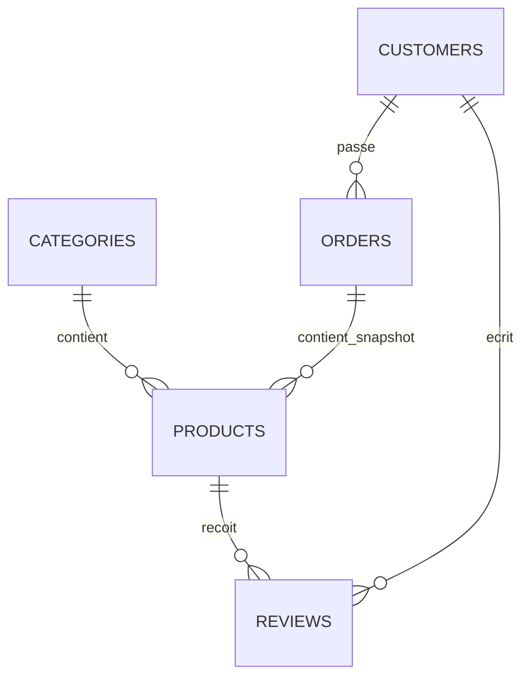

# Catalogue intelligent de produits - Projet NoSQL MongoDB

## 1. Sujet choisi

Le sujet choisi est un **catalogue de produits pour un site e-commerce coté Admin**.

L’application permet de :
- consulter le catalogue de produits ;
- filtrer les produits par catégorie, prix, note ou disponibilité ;
- suivre les stocks faibles ;
- analyser le chiffre d’affaires ;
- afficher les commandes à traiter ;
- proposer des recommandations simples à un client.

## 2. Pourquoi NoSQL ?

MongoDB est un bon choix car les produits ont des caractéristiques différentes selon leur catégorie.

Exemple :
- un ordinateur possède une RAM, un stockage et une taille d’écran ;
- un casque possède une autonomie et une réduction de bruit ;
- un objet connecté possède des protocoles ou une compatibilité assistant vocal.

Avec MongoDB, chaque produit peut avoir un champ `specs` flexible sans devoir créer beaucoup de tables SQL différentes. Les commandes peuvent aussi embarquer un résumé des produits achetés, ce qui simplifie les lectures côté API.

## 3. Collections utilisées

Le projet utilise 5 collections MongoDB :

| Collection | Rôle |
|---|---|
| `categories` | Stocke les catégories du catalogue. |
| `products` | Stocke les produits, leurs prix, stocks, notes et caractéristiques. |
| `customers` | Stocke les clients, leur ville, niveau de fidélité et intérêts. |
| `orders` | Stocke les commandes avec les produits achetés. |
| `reviews` | Stocke les avis clients liés aux produits. |

## 4. Diagramme document / relations



Version document NoSQL :

```text
categories
  - _id
  - name
  - slug
  - description

products
  - _id
  - name
  - slug
  - brand
  - categorySlug
  - price
  - stock
  - sold
  - averageRating
  - tags[]
  - specs{}
  - description

customers
  - _id
  - name
  - email
  - loyaltyLevel
  - address{ city, country }
  - interests[]

orders
  - _id
  - orderNumber
  - customerId
  - items[] { productId, productName, categorySlug, price, quantity }
  - total
  - status
  - createdAt

reviews
  - _id
  - productId
  - customerId
  - rating
  - title
  - comment
  - createdAt
```

## 5. Besoins utilisateurs

1. En tant que responsable, je veux rechercher un produit par mot-clé.
2. En tant que responsable, je veux filtrer les produits par catégorie.
3. En tant que responsable, je veux voir uniquement les produits disponibles.
4. En tant que responsable, je veux trouver les produits les mieux notés.
5. En tant que responsable, je veux trouver des produits selon le budget client.
6. En tant que responsable, je veux consulter la fiche détaillée d’un produit.
7. En tant que responsable, je veux lire les avis d’un produit.
8. En tant que responsable e-commerce, je veux voir les produits en stock faible.
9. En tant que responsable e-commerce, je veux voir les meilleures ventes.
10. En tant que responsable e-commerce, je veux calculer le chiffre d’affaires total.
11. En tant que responsable e-commerce, je veux analyser le chiffre d’affaires par catégorie.
12. En tant que responsable e-commerce, je veux suivre les ventes par mois.
13. En tant que responsable logistique, je veux voir les commandes à traiter.
14. En tant que marketing, je veux savoir quelles villes génèrent le plus de ventes.
15. En tant que marketing, je veux recommander des produits selon l’historique client.

## 6. Requêtes préparées

Les 15 requêtes MongoDB sont dans :

```text
docs/requetes_mongodb.js
```

Elles couvrent : recherche, filtres, stock faible, meilleures ventes, fiche produit, avis, chiffre d’affaires, ventes mensuelles, commandes à traiter, villes, avis négatifs, clients gold et recommandations.

## 7. API REST

L’API expose volontairement seulement 5 endpoints principaux pour respecter la consigne de démo.

| Endpoint | Rôle |
|---|---|
| `GET /api/dashboard` | KPI, stock faible, produits bien notés. |
| `GET /api/products` | Recherche, filtres et tris du catalogue. |
| `GET /api/products/:slug` | Fiche complète d’un produit avec ses avis. |
| `GET /api/recommendations/:customerId` | Recommandations selon l’historique client. |
| `GET /api/analytics?type=...` | Analyses : top produits, CA par catégorie, ventes mensuelles, commandes à traiter, etc. |

Exemples :

```bash
http://localhost:3000/api/dashboard
http://localhost:3000/api/products?category=gaming&minRating=4&sort=rating
http://localhost:3000/api/products/casque-airsound-pro
http://localhost:3000/api/analytics?type=revenue-by-category
http://localhost:3000/api/analytics?type=pending-orders
```

## 8. Installation et lancement

### Prérequis

- Node.js installé
- MongoDB lancé en local
- MongoDB Compass conseillé pour les captures

### Étapes

```bash
npm install
copy .env.example .env
npm run seed
npm start
```

Sur Mac/Linux :

```bash
cp .env.example .env
npm run seed
npm start
```

Puis ouvrir :

```text
http://localhost:3000
```

## 9. Front web

Le front est dans le dossier `public`.
Il permet de montrer :
- le tableau de bord ;
- le catalogue filtré ;
- les meilleures ventes ;
- le chiffre d’affaires par catégorie ;
- les commandes à traiter ;
- les recommandations client.

## 10. Captures et vidéo

Les captures sont dans :

```text
docs/Capture
```
